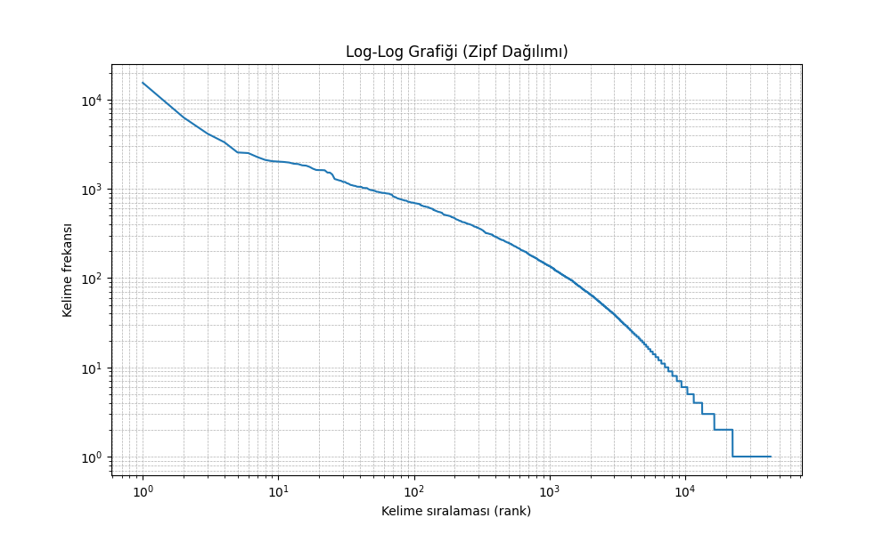

# 📘 NLP Projesi: Word2Vec & TF-IDF ile Anlamsal Benzerlik

## 👤 Öğrenci Bilgileri

- **👨‍🎓 Ad Soyad**: Yusuf Erdem DALCA  
- **📅 Teslim Tarihi**: 2025-05-04  
- **🧪 Ders**: Doğal Dil İşleme

---


## 🎯 Amaç

> Kelimeleri vektörlerle temsil ederek, anlamsal yakınlık ve bağlam bilgisini modellemek.

---

## 🛠️ Kullanılan Yöntemler

### 🔡 Word Embedding

- **Word2Vec (CBOW & Skip-Gram)**
- **16 kombinasyon**:
  - 2 mimari (CBOW / SkipGram)
  - 2 window-size (4, 10)
  - 2 dimension (300, 1000)
  - 2 veri tipi (Lemmatized / Stemmed)

| ID | Veri | Model | Window | Dim | Python Dosyası |
|----|------|-------|--------|-----|----------------|
| 1  | Lemma | CBOW  | 4      | 300 | model_1.py     |
| 2  | Lemma | CBOW  | 4      | 1000| model_2.py     |
| .. | ...   | ...   | ...    | ... | ...            |
| 16 | Stem  | SkipG | 10     | 1000| model_16.py    |

---

### 📊 TF-IDF

- `TfidfVectorizer` ile 2 vektör matrisi oluşturulmuştur:
  - `tfidf_lemmatized.csv`
  - `tfidf_stemmed.csv`

> Her satır: kelime | Her sütun: cümle  
> Cosine benzerliği ile "game" kelimesine yakın kavramlar çıkarılmıştır.

---

## 🔬 Model Testi

| Model | Test Edilen Kelime | Örnek Çıktı |
|-------|---------------------|-------------|
| Word2Vec | `game` | `['leveldesign', 'formulating', ...]` |
| TF-IDF  | `game` | `['engine', 'project', ...]` |

Tüm testler `test_word2vec_models.py` ve `test_tf_idf.py` içinde gerçekleştirilmiştir.

---

## 📈 Zipf Yasası Analizi



- Kelime uzunluklarına göre log-log frekans dağılımı
- `tokenized_sentences.txt` üzerinden çıkarılmıştır
- Zipf kanununun dil modellemesi üzerindeki etkisini gösterir

---

## 🧩 Gereken Kütüphaneler

```bash
pip install numpy pandas gensim nltk matplotlib scikit-learn
 
```

### 📌 Notlar
- `.model` dosyaları **büyük boyutlu olduğu için proejeden çıkartılmıştır**, test yapmadan önce önce modelleri gerekli kodlarla oluşturduğunuzdan emin olunuz. Dosya yollarının doğruluğunu kontrol ediniz.
- Python script dosyalarının isimleri sadeleştirilmiştir:
  - Örn: `model_1.py`, `model_2.py`, ..., `model_16.py`
- `processed_sentences.csv` dosyasında:
  - `"Lemmatized"` ve `"Stemmed"` sütunları hazırdır.
  - Her satır temizlenmiş bir cümleyi temsil eder.

---

### ✅ Tamamlananlar
- ✅ 16 adet farklı parametre kombinasyonuyla **Word2Vec modeli** üretildi.
- ✅ **TF-IDF** hesaplamaları hem `lemmatized` hem `stemmed` veriler için ayrı ayrı yapıldı.
- ✅ `"game"` kelimesine benzer en yakın kelimeler başarıyla analiz edildi.
- ✅ **Zipf yasası** log-log grafikleri üretildi.
- ✅ **Test scriptleri** yazıldı ve her modelin çıktıları kontrol edildi.