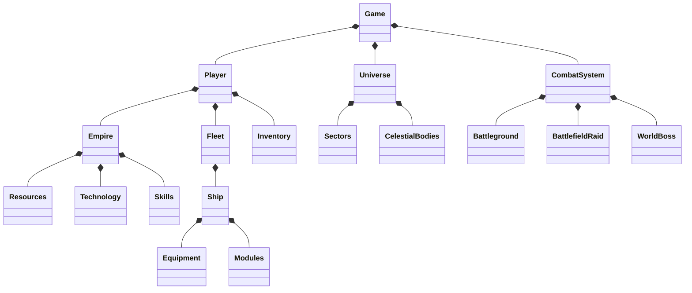

# Dark Alpha Engine Space Combat Game

## Core Systems Overview

### 1. Empire Management
- Race Selection (StarTrek & Custom Races)
- Empire Skills & Titles
- Resource Management
- Territory Control
- Technology Research
- Prestige & Ascension Systems

### 2. Combat Systems
- Real-time Ship Combat
- 3v3 Battlegrounds
- 6-Player Raids
- World Boss Events
- Fleet Management
- Ship Customization

### 3. Social Features
- Alliance System
- Corporation System
- Party System
- Dungeon Finder
- Message System
- Trading Network

### 4. Economy
- Market System
- Alliance Banks
- Trade Routes
- Resource Collection
- Ship Building
- Research Investment

### 5. Progression Systems
- Empire Leveling
- Ship Upgrades
- Technology Tree
- Race Evolution
- Divine Favor System
- Battle Pass

### 6. Technical Features
- Cross-Platform Support
- Real-time Multiplayer
- Save System
- Audio System
- Tutorial System
- Codex System

## Game Architecture

## Core Classes

### Game
- Manages core game systems
- Handles player interactions
- Controls game state
- Manages multiplayer sessions

### Player
- Character progression
- Inventory management
- Fleet control
- Empire management

### Universe
- Galaxy generation
- Sector management
- Resource distribution
- Navigation systems

### Combat
- Battle mechanics
- Damage calculation
- Fleet formations
- Combat rewards

## Development Roadmap
1. Core Systems Implementation
2. Multiplayer Integration
3. Economy Balance
4. Content Expansion
5. Polish & Optimization

## Detailed Feature Specifications

### Ship Combat System
- Real-time tactical combat
- Formation-based fleet positioning
- Ship specialization roles
- Counter system between ship types
- Battle formations unlock at higher levels

### Resource Management
- Multiple resource types (minerals, energy, rare materials)
- Resource nodes in different sectors
- Trade routes between systems
- Resource conversion and refinement
- Storage capacity management

### Divine Favor System
- Multiple deities with unique bonuses
- Favor points earned through actions
- Divine interventions during combat
- Special divine quests
- Deity-specific technologies

### Territory Control
- Sector control mechanics
- Resource production bonuses
- Defense structure placement
- Territory raid mechanics
- Alliance territory sharing

### Battle Pass System
- Seasonal rewards structure
- Daily and weekly missions
- Premium reward tracks
- Exclusive cosmetics
- Special event participation

### Cross-Platform Features
- Unified account system
- Cross-platform chat
- Shared marketplace
- Universal save system
- Platform-specific optimizations
