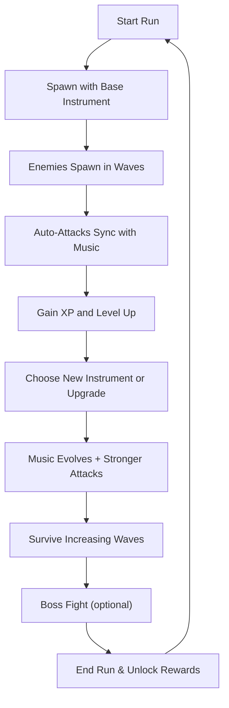

# Rythm Judgement  
**Design Document**  
_By Diogo Sabec, credits to Aizin for the Template_

---

## Introduction  
[High Concept](#high-concept)  
[Inspiration](#inspiration)  
[Player Experience](#player-experience)  
[Platform](#platform)  
[Development Software](#development-software)  
[Genre](#genre)  
[Target Audience](#target-audience)  
[Concept](#concept)  
[Primary Weapons](#primary-weapons)  
[Items](#items)  
[Art](#art)  
[Audio](#audio)  
[Game Experience](#game-experience)  
[Future Plans](#future-plans)  
[Credits](#credits)  

---

## High Concept  
*Rythm Judgement* is a rhythm-infused bullet-heaven game where music and combat blend into a powerful experience. Inspired by *Vampire Survivors*, players control a character with simple movement-based controls, while attacks automatically sync with the rhythm of the music. As players collect new instrument-based weapons, the soundtrack dynamically evolves—each new instrument adding layers to both the audio and gameplay. With gothic visuals inspired by *Castlevania* and mechanics drawn from rhythm classics like *Crypt of the NecroDancer* and *Guitar Hero*, the game offers a unique mix of action, strategy, and musical immersion.

---

## Inspiration

| **<ins>Vampire Survivors</ins>** |  |
| --------- | ---- |
| Major gameplay features inspired by this. Simple inputs, only moving around with the character, auto-attacks and continuous leveling up| 
| **<ins>Castlevania: Symphony of the Night</ins>** |  |
| All art will be inspired on this game, gothic/dark vibes. |  |
| **<ins>Crypt of the NecroDancer</ins>** |  |
| Rythm style. Attacks give more damage if player makes an action at the right time |  |
| **<ins>Guitar Hero</ins>** |  |
| Scoring system, if player gets inputs in time with music may trigger special effects |  |

---

## Player Experience

For this MVP the player will experience one map with simple mechanics and only one music. The player will need to understand the base mechanics in a organic way.

---

## Platform

The game is developed to be released on Windows PC

---

## Development Software

- **Game Engine:** Godot 4.2 for the MVP version. Planning to move to Unity.  
- **Graphics & UI:** Aseprite  
- **Audio:** FL Studio 12

---

## Genre

- Singleplayer  
- Action  
- RPG

---

## Target Audience

This rhythm-based twist on Vampire Survivors targets both casual and rhythm game fans who enjoy intuitive gameplay with a musical flair, as well as more seasoned players looking for a fresh, creative spin on progression mechanics. With evolving soundtracks tied to in-game power, it appeals to music lovers, creative thinkers, and players who enjoy satisfying audiovisual feedback tied to their actions.

---

## Concept

### Gameplay Overview  
The player controls one character, its only controls are moving around. Attacks will be automatic, always hitting in sync with the music. As the player starts it will only have one instrument, and the track of the music will be with only the selected instrument. As the player levels up, they will unlock more instruments, which add layers to the music.  

As the player upgrades their instruments, the instrument will have a more important role in the song.  
In some instruments, if the player performs a specific action in sync with the beat, it will trigger a special effect.

---

## Primary Weapons

Weapons/Instruments that the character will get when levelling up.

| Mechanic | Description | Image |
|---------|-------------|-------------|
| **Guitar** | Shoots a direct hit in a nearby enemy. | img.png |
| **Drums** | When activated, gives area damage around the player. | img.png |
| **Violin** | Shoots a continuous ray on an enemy. | img.png |
| **Piano** | Hits a random visible enemy on the screen. Gives small area damage. | img.png |

---

## Items

Items that help with combos.

| Mechanic | Description | Image |
|---------|-------------|-------------|
| **Sheet Music** | Gives you a visual reference, increasing your critical hit %. | img.png |
| **Conductor's Baton** | Makes you more in sync with the music. Grants damage % increase. | img.png |

---

## Art

### Style  
Pixel art, heavily inspired by Vampire Survivors and Castlevania: Symphony of the Night.

### Design  
Gothic religious figures. Inspired by Castlevania: Symphony of the Night, Berserk, and Gothic churches.

---

## Audio

### Music  
Each map will have a different music theme with different instruments and motifs. Most of the soundtrack will be rock-inspired, drawing inspiration from Castlevania: Symphony of the Night.

---

## Game Experience

## Character  

### Protagonist  
You play as **Magnus, The Exorcist**, a mysterious, silent figure trained in sacred musical rites used to purge evil. The character’s design is heavily inspired by medieval religious iconography and gothic fashion—long robes, relics, and a glowing instrument strapped to their back. The protagonist does not speak but communicates visually through animations and reactions to the music.  

---

## Camera  

The game uses a **top-down 2D camera**, similar to *Vampire Survivors* or *Enter the Gungeon*. The camera follows the player character smoothly with slight zooms or pulses when beat-based events occur (e.g., crits, combo triggers), giving a rhythmic "bounce" that reinforces player timing and feedback.

**Camera Features:**  
- Slight zoom-out as the action intensifies  
- Pulse or shake synced with the beat during special combos or boss phases  
- Optional motion toggle for accessibility  

---

## Controls  

### Keyboard  
- **WASD / Arrow Keys** – Move  
- **Spacebar** – (Future) Activate Beat Power (if equipped)  
- **Enter** – Confirm / Interact  
- **Esc** – Pause/Menu  

### Gamepad  
- **Left Stick / D-Pad** – Move  
- **A / X** – Confirm / Interact  
- **Start** – Pause/Menu  

**Note:** Combat is automatic, synced with the beat. Some weapons may include active abilities requiring timing input.

---

## Core Loop

---

### UI  

Pixel art UI with gothic elements.

---

## Future Plans

- Add multiple maps, each with a unique music style and visual theme  
- Introduce bosses that sync their attack patterns with musical transitions  
- Expand the library of instruments and create more complex audio layering  
- Add difficulty options that change tempo and rhythm mechanics  
- Implement local or online leaderboards for rhythm accuracy and combo chains  
- Explore potential for co-op or versus multiplayer in rhythm battles  

---

## Credits

**Game Design:** Diogo Sabec  
**Template Credit:** Aizin  
**Art & Pixel Assets:** Diogo Sabec (using Aseprite)  
**Audio & Music Composition:** Diogo Sabec (using FL Studio 12)  
**Engine:** Godot 4.2 (for MVP), with plans to migrate to Unity for scalability  
